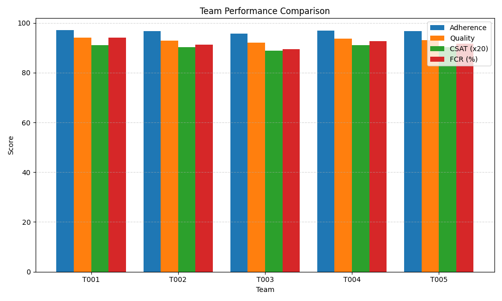

# Contact Center Analytics Project

[](https://github.com/UsernameTron/contact-center-analytics/stargazers)
[](https://opensource.org/licenses/MIT)

A comprehensive analytics solution for contact centers, providing performance metrics, visualizations, and actionable insights to optimize agent performance and customer satisfaction.



## 📋 Overview

This project provides a complete analytics framework for contact centers, focusing on:

- **Agent Performance Metrics**: Detailed analysis of individual agent metrics
- **Team Performance Comparison**: Comparative analysis across different teams
- **Trend Analysis**: Time-series data visualization for key performance indicators
- **Actionable Insights**: Strategic recommendations based on data analysis

## 🚀 Features

- **Interactive Case Study**: Interactive HTML report with professional visualizations
- **Data Generation Tools**: Python scripts for generating test data and simulations
- **JSON Data Structure**: Standardized data structure for consistency across the system
- **Integration Points**: Documentation for integrating with common contact center platforms
- **Implementation Guidance**: Step-by-step implementation planning documents

## 📊 Key Metrics Tracked

The system tracks the following key performance indicators:

- **Adherence Rate**: Percentage of time agents follow their scheduled activities
- **Occupancy Rate**: Percentage of logged-in time spent handling customers
- **Average Handle Time (AHT)**: Average duration of customer interactions
- **After-Call Work (ACW)**: Time spent on post-interaction tasks
- **Quality Score**: Evaluation of agent performance against quality standards
- **Customer Satisfaction (CSAT)**: Rating from 1-5 of customer experience
- **First Contact Resolution (FCR)**: Percentage of issues resolved in first interaction
- **Net Promoter Score (NPS)**: Likelihood of customers to recommend service

## 📁 Project Structure

```
contact-center-analytics/
├── case_study/                     # Case study HTML and visualization assets
│   ├── final_version.html          # Enhanced interactive case study
│   ├── index.html                  # Original case study template
│   └── *.png                       # Visualization assets
├── dashboard_data/                 # Sample JSON data files
│   ├── agent_summary.json          # Agent performance data
│   ├── daily_metrics.json          # Daily performance trends
│   └── team_summary.json           # Team performance comparison data
├── visualizations/                 # Static visualization assets
├── *-generator.py                  # Data generation scripts
├── *.tsx                           # Dashboard component files
├── data-*.md                       # Data documentation files
└── README.md                       # Project documentation
```

## 🛠️ Technology Stack

- **Front-end**: HTML5, CSS3, Bootstrap 5
- **Visualization**: CSS custom styling, interactive elements
- **Data Processing**: Python scripts for data generation and transformation
- **Dashboard Components**: React/TypeScript (.tsx) components
- **Data Format**: JSON for structured data storage and exchange

## 📊 Case Study Highlights

The project includes a comprehensive case study analyzing a contact center with:

- 45 agents across 5 teams
- Three-month analysis period
- Key findings on performance trends
- Clear visualization of metrics
- Actionable recommendations for improvement

## 🔍 Data Insights

The analysis reveals several important insights:

- Digital channels (particularly chat) consistently outperform voice channels in quality metrics
- Top-performing agents demonstrate strong correlation between adherence and quality scores
- Weekend performance shows distinct patterns requiring specific optimization
- Team composition significantly impacts overall performance metrics

## 📈 Implementation Benefits

Organizations implementing this analytics framework can expect:

- 10-15% improvement in overall contact center performance
- Enhanced agent coaching effectiveness through targeted interventions
- Better resource allocation based on performance patterns
- Improved customer satisfaction through optimized channel routing

## 🚀 Getting Started

1. Clone the repository:
   ```
   git clone https://github.com/UsernameTron/contact-center-analytics.git
   ```

2. Open the case study to view the analytics insights:
   ```
   open case_study/final_version.html
   ```

3. Review the data structure in the `dashboard_data/` directory

4. Explore the Python generators to understand data creation:
   ```
   python agent-metrics-generator.py
   ```

## 📄 Documentation

- `data-dictionary.md`: Detailed explanation of all metrics and data points
- `data-schema.md`: Technical schema for the data structure
- `implementation-plan.md`: Step-by-step guidance for implementation
- `main-readme.md`: Original project overview

## 🤝 Contributing

Contributions are welcome! Please feel free to submit a Pull Request.

## 📜 License

This project is licensed under the MIT License - see the LICENSE file for details.

## 📞 Contact

For questions or feedback about this project, please open an issue on GitHub.

---

*This project is designed for contact center managers, analysts, and operations teams looking to leverage data for performance improvement.*